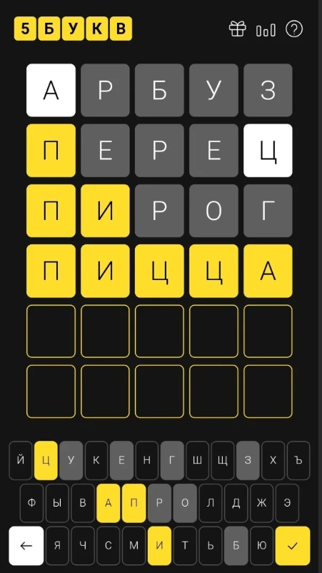
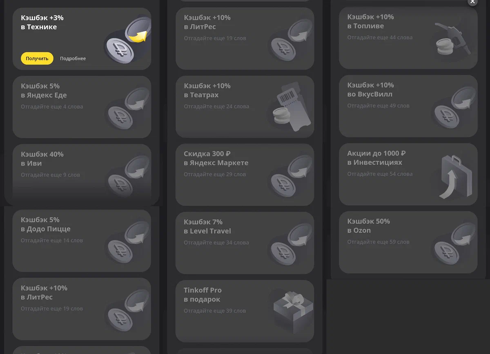

 # Небольшая програмка, почти шутка, написал на 1 курсе.
 
## Описание

Данная программа является помощником в игре 5 букв от тинькофф. Проводилась акция, за угаданные слова раздавали призы. Для проверки работоспособности можно скачать любую подобную игру, из вашего магазина приложений. да, я забрал все призы.

### Синоптический код КН-01

### Таблица для группы ww

